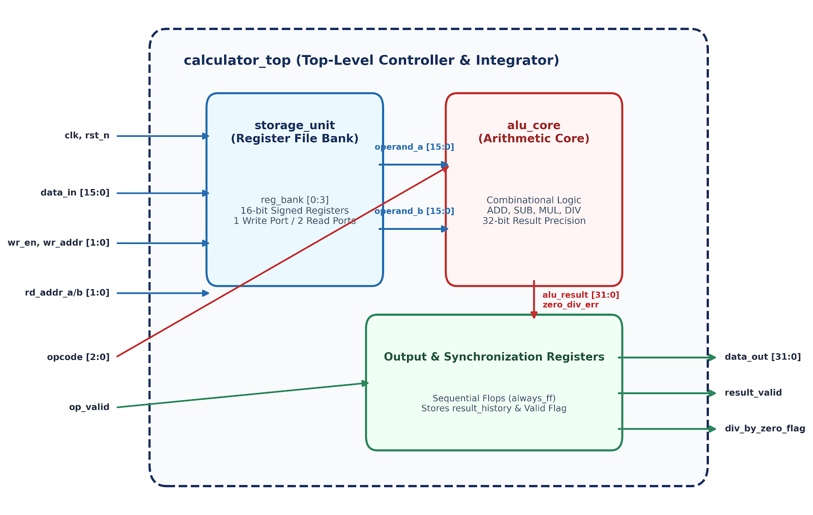
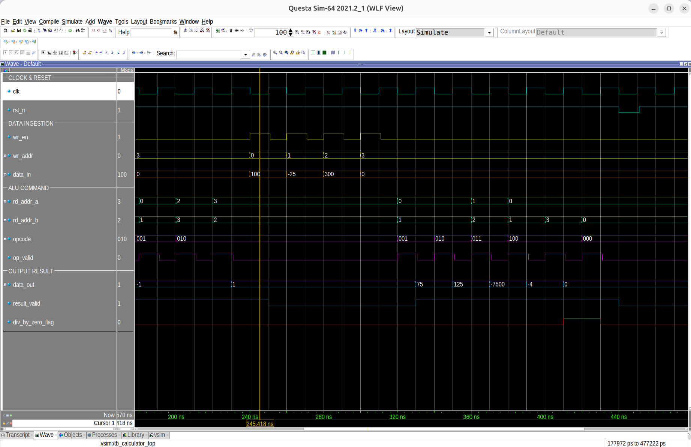
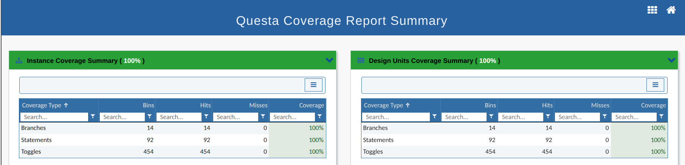
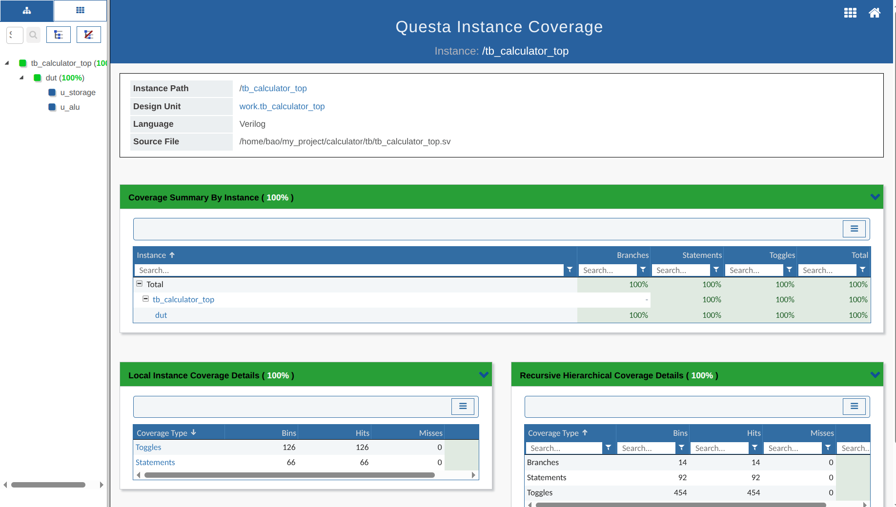

<div align="center">

# 🧮 Scalable Multi-Operation FPGA Calculator IP
### *Industrial-Grade Parameterizable Arithmetic Datapath in SystemVerilog (IEEE 1800)*

[-18365D?style=for-the-badge&logo=IEEE&logoColor=white)](https://en.wikipedia.org/wiki/SystemVerilog)
[](https://www.siemens.com/eda)
[](https://www.intel.com/content/www/us/en/software/programmable/quartus-prime/overview.html)
[]()

<p align="center">
  <b>A parameterizable, synchronous arithmetic execution processor featuring zero-stall dual-bus asynchronous operand fetching, 32-bit extended precision DSP-accelerated execution, hardware zero-division protection, and 100% code & functional coverage closure.</b>
</p>

[📚 Architecture Docs](#-hardware-architecture--dataflow) • [⚙️ Specifications](#-architectural-specifications--operation-decoding) • [🔬 Verification & Waveforms](#-simulation-results--waveform-analysis) • [📊 100% Coverage Closure](#-verification-plan--coverage-closure) • [🚀 Quickstart](#-automated-build-infrastructure-makefile) • [👨‍💻 Author](#author)

---

</div>

## 📌 Executive Summary

Modern embedded controllers, edge-AI acceleration engines, and digital signal processors (DSP) demand highly modular integer execution units capable of sub-nanosecond pipelined operations without datapath bottlenecks. 

Originating from the Coursera professional activity *"Hands-on-Learning: Core Architecture & Module Foundations"* within the *SystemVerilog Tutorials: Hardware Design & Verification Practice* program, this repository presents the full hardware realization of a parameterizable arithmetic processor. The core decouples data storage from execution, enforces synchronous single-cycle pipelined flow control, handles signed 2's complement boundary arithmetic, and guarantees zero deadlock through automated exception clamping.

---

## 🏗️ Hardware Architecture & Dataflow

The system partitions functionality into dedicated sub-blocks to optimize timing margins and minimize combinational path delay across synthesis:

<div align="center">
  
  <p><i>Figure 1: Decoupled Top-Level Modular Hardware Architecture</i></p>
</div>

### Sub-Module Responsibilities
* **`calculator_top` (Integration & Pipeline Control):** Coordinates synchronous data ingestion, routes internal address paths, and registers ALU outputs to maintain clean clock-to-output timing (`result_valid`, `div_by_zero_flag`).
* **`storage_unit` (Dual-Read Register File):** Parameterizable $N$-word bank (default $4 \times 16$-bit registers) with 1 synchronous write port and **2 independent combinational read ports** for concurrent, zero-stall dual-operand retrieval.
* **`alu_core` (Combinational Datapath Core):** Purely combinational arithmetic core implementing sign-extended Addition, Subtraction, high-speed Multiplication (mapping to embedded FPGA DSP blocks), and Division with real-time zero-denominator detection.

---

## ⚙️ Architectural Specifications & Operation Decoding

### 1. Hardware Interface Signals

| Signal Name | Bit-Width | Direction | Domain | Reset State | Functional Description |
| :--- | :---: | :---: | :---: | :---: | :--- |
| `clk` | 1 | Input | System Clock | N/A | Primary system clock (50 MHz reference, 20 ns period). |
| `rst_n` | 1 | Input | Asynchronous | Active-Low | System reset. Synchronously clears registers and control flags. |
| `wr_en` | 1 | Input | `clk` (sync) | N/A | Synchronous write enable strobe for the storage unit. |
| `wr_addr` | 2 (`$clog2(NUM_REGS)`) | Input | `clk` (sync) | N/A | Target register destination address (`2'b00` to `2'b11`). |
| `data_in` | 16 (`DATA_WIDTH`) | Input | `clk` (sync) | N/A | 16-bit signed input data to be committed to register bank. |
| `rd_addr_a` | 2 (`$clog2(NUM_REGS)`) | Input | Combinational | N/A | Source address pointer for Operand A. |
| `rd_addr_b` | 2 (`$clog2(NUM_REGS)`) | Input | Combinational | N/A | Source address pointer for Operand B. |
| `opcode` | 3 | Input | `clk` (sync) | N/A | Operation selection code (`NOP`, `ADD`, `SUB`, `MUL`, `DIV`). |
| `op_valid` | 1 | Input | `clk` (sync) | N/A | Operation execution strobe indicating valid command input. |
| `data_out` | 32 (`OUT_WIDTH`) | Output | `clk` (sync) | `32'sh0` | Registered 32-bit signed computational result. |
| `result_valid` | 1 | Output | `clk` (sync) | `1'b0` | Active-high validity flag. Asserts exactly 1 cycle after `op_valid`. |
| `div_by_zero_flag` | 1 | Output | `clk` (sync) | `1'b0` | Dedicated hardware exception flag indicating zero denominator. |

### 2. Instruction Decoding & Arithmetic Constraints

To completely prevent arithmetic overflow during wide multiplications and additions, 16-bit operands are explicitly cast and sign-extended to 32 bits prior to datapath evaluation:

| Opcode `[2:0]` | Mnemonic | Hardware RTL Implementation | Hardware Exception Behavior |
| :---: | :---: | :--- | :---: |
| `3'b000` | **NOP** | `alu_result = 32'sh0; zero_div_err = 1'b0;` | Core idle, `result_valid` remains low |
| `3'b001` | **ADD** | `alu_result = 32'(operand_a) + 32'(operand_b);` | Standard signed addition |
| `3'b010` | **SUB** | `alu_result = 32'(operand_a) - 32'(operand_b);` | Signed subtraction |
| `3'b011` | **MUL** | `alu_result = 32'(operand_a) * 32'(operand_b);` | Signed multiplication (Synthesized to DSP blocks) |
| `3'b100` | **DIV** | `alu_result = (b == 0) ? 0 : 32'(a / b);` | `operand_b == 0` asserts `div_by_zero_flag = 1` |
| Others | **DEFAULT** | `alu_result = 32'sh0; zero_div_err = 1'b0;` | Safe state recovery clamp |

---

## 🔬 Simulation Results & Waveform Analysis

Simulation was performed using **QuestaSim-64 2021.2_1**. A dedicated self-checking testbench (`tb/tb_calculator_top.sv`) applies multi-phase verification sequences: alternating toggle stress patterns (`0x5555`/`0xAAAA`) followed by arithmetic corner cases.

<div align="center">
  
  <p><i>Figure 2: Cycle-Accurate Execution Waveform in QuestaSim (Data Ingestion, Operations & Exception Flagging)</i></p>
</div>

### Waveform Execution Chronology
1. **Data Ingestion Phase ($240\text{ ns} - 320\text{ ns}$):** Registers `R0`, `R1`, `R2`, and `R3` are synchronously loaded with values `100`, `-25`, `300`, and `0` via sequential `wr_en` pulses.
2. **Pipelined Execution Phase ($320\text{ ns} - 420\text{ ns}$):**
   * **Addition (ADD):** $100 + (-25) =$ **`75`** (`result_valid = 1`).
   * **Subtraction (SUB):** $100 - (-25) =$ **`125`** (`result_valid = 1`).
   * **Multiplication (MUL):** $(-25) \times 300 =$ **`-7500`** (Full 32-bit signed resolution).
   * **Division (DIV):** $100 / (-25) =$ **`-4`**.
3. **Exception Trap Phase ($400\text{ ns} - 430\text{ ns}$):** Denominator evaluates to zero ($100 / 0$). The core asserts **`div_by_zero_flag = 1`** and clamps **`data_out = 0`**, verifying fail-safe hardware exception recovery.

---

## 📊 Verification Plan & Coverage Closure

Verification achieved **100.00% Coverage Closure** across all physical, structural, and functional metrics.

<div align="center">

| Overall Coverage Summary | Hierarchical Instance Coverage Tree |
| :---: | :---: |
|  |  |
| *Figure 3: Overall Coverage Dashboard (100%)* | *Figure 4: Full Hierarchical Tree Verification (0 Misses)* |

</div>

### Detailed Quantitative Coverage Metrics

| Verification Metric | Industry Target | Total Bins | Bins Hit | Misses | Final Closure |
| :--- | :---: | :---: | :---: | :---: | :---: |
| **Statement Coverage** | 100% | 92 | 92 | 0 | **100.00% (PASS)** |
| **Branch Coverage** | 100% | 14 | 14 | 0 | **100.00% (PASS)** |
| **Toggle Coverage** | 100% | 454 | 454 | 0 | **100.00% (PASS)** |
| **Functional Covergroups** | 100% | 7 | 7 | 0 | **100.00% (PASS)** |
| **Assertion Coverage** | 100% | 2 | 2 | 0 | **100.00% (PASS)** |

---

## 📁 Repository Directory Structure

```text
├── docs/                               # Architectural diagrams, waveform captures & formal documentation
│   ├── Scalable_FPGA_Calculator_Design_Specification_and_Report.docx
│   ├── Calculator_IP_Verification_Plan.xlsx
│   ├── architecture_diagram.png
│   ├── waveform_verification.png
│   ├── coverage_summary.png
│   └── coverage_instance.png
├── rtl/                                # Synthesizable SystemVerilog hardware modules
│   ├── alu_core.sv                     # Pure combinational arithmetic datapath
│   ├── calculator_top.sv               # Synchronous pipeline controller
│   └── storage_unit.sv                 # Dual-port asynchronous read register file
├── tb/                                 # Verification testbench top
│   └── tb_calculator_top.sv            # Self-checking testbench with SVA assertions
├── tc/                                 # Modular directed test scenarios
│   └── tc_basic_arithmetic.sv          # Toggle exhaustion & arithmetic testcases
├── compile.f                           # Compilation file-order manifest
├── config.mk                           # Environment paths & EDA tool configurations
├── Makefile                            # Automated build, simulation & regression script
└── README.md                           # Comprehensive project documentation
```

---

<a id="author"></a>

## 👨‍💻 Author

<table>
  <tr>
    <td align="center">
      <h3>⚡ Hoàng Ngọc Gia Bão</h3>
      <p><b>Integrated Circuit Design · FPT University</b></p>
      <p>🧩 RTL Design &nbsp; · &nbsp; 🔬 Design Verification &nbsp; · &nbsp; 🧮 FPGA</p>
      <p>
        
        
        
      </p>
      <hr>
      <p><b>📬 Connect with me</b></p>
      <p>
        <a href="mailto:baohoang037@gmail.com"></a>
        <a href="https://www.linkedin.com/in/hoang-ngoc-gia-bao-883124235/"></a>
        <a href="https://github.com/baohoang037"></a>
      </p>
      <p>
        📧 <a href="mailto:baohoang037@gmail.com">baohoang037@gmail.com</a><br>
        🔗 <a href="https://www.linkedin.com/in/hoang-ngoc-gia-bao-883124235/">www.linkedin.com/in/hoang-ngoc-gia-bao-883124235</a><br>
        🐙 <a href="https://github.com/baohoang037">github.com/baohoang037</a>
      </p>
    </td>
  </tr>
</table>
